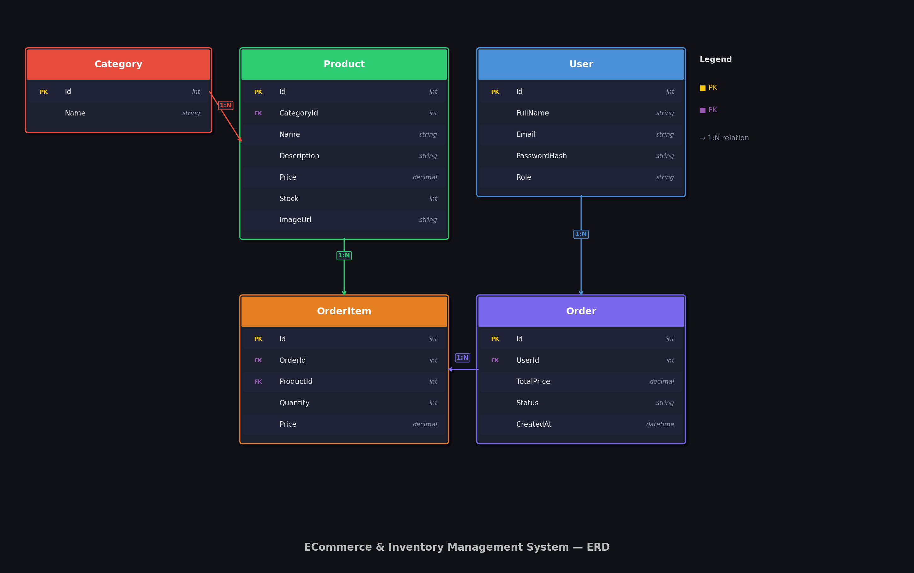

#  ECommerce & Inventory Management System

A full-stack E-Commerce and Inventory Management System built with **ASP.NET Core 8 Web API** and **Angular 22**. Features role-based access control, JWT authentication, product management, order processing, and real-time inventory tracking — built with Clean N-Tier Architecture.

---

##  Database Schema (ERD)



---

##  Features

### Role-Based Access Control

| Role | Permissions |
|------|------------|
| **Admin** | Full control — users, products, branches, analytics |
| **Seller** | Manage own products, view orders & sales |
| **Customer** | Browse products, place orders, track history |
| **Clerk** | Handle inventory, manage stock requests |

###  Authentication & Security
- JWT-based login & registration
- BCrypt password hashing
- Role-based route protection
- Token expiry (7 days)

###  Products & Categories
- Full CRUD for products and categories
- Stock tracking with low-inventory alerts
- Image URL support

###  Orders
- Shopping cart management
- Order placement and history
- Real-time stock deduction on order

---

##  Tech Stack

### Backend
| Technology | Purpose |
|-----------|---------|
| ASP.NET Core 8 Web API | REST API |
| Entity Framework Core 8 | ORM |
| SQL Server | Database |
| JWT Bearer | Authentication |
| BCrypt.Net | Password hashing |
| AutoMapper | DTO mapping |
| N-Tier Clean Architecture | Project structure |

### Frontend
| Technology | Purpose |
|-----------|---------|
| Angular 22 | SPA Framework |
| NgRx SignalStore | State management |
| Bootstrap 5 | UI components |
| TypeScript | Language |

---

##  Project Structure

```
ECommerceAPI/
├── Models/          # Database entities
├── DTOs/            # Data Transfer Objects
├── Data/            # DbContext & migrations
├── Repositories/    # Data access layer
├── Services/        # Business logic layer
└── Controllers/     # API endpoints
```

---

##  API Endpoints

### Auth
| Method | Endpoint | Description | Auth |
|--------|----------|-------------|------|
| POST | `/api/auth/register` | Register new user | Public |
| POST | `/api/auth/login` | Login & get JWT token | Public |

### Products
| Method | Endpoint | Description | Auth |
|--------|----------|-------------|------|
| GET | `/api/products` | Get all products | Public |
| GET | `/api/products/{id}` | Get product by ID | Public |
| POST | `/api/products` | Create product | Admin, Seller |
| PUT | `/api/products/{id}` | Update product | Admin, Seller |
| DELETE | `/api/products/{id}` | Delete product | Admin |

### Categories
| Method | Endpoint | Description | Auth |
|--------|----------|-------------|------|
| GET | `/api/categories` | Get all categories | Public |
| POST | `/api/categories` | Create category | Admin |
| DELETE | `/api/categories/{id}` | Delete category | Admin |

### Orders
| Method | Endpoint | Description | Auth |
|--------|----------|-------------|------|
| POST | `/api/orders` | Place new order | Authenticated |
| GET | `/api/orders` | Get my orders | Authenticated |

---

## Getting Started

### Prerequisites
- [.NET 8 SDK](https://dotnet.microsoft.com/download/dotnet/8.0)
- [SQL Server](https://www.microsoft.com/en-us/sql-server)
- [Visual Studio 2022+](https://visualstudio.microsoft.com/)

### Setup

1. **Clone the repository**
```bash
git clone https://github.com/KhlouddAhmed/ECommerceAPI.git
cd ECommerceAPI
```

2. **Update connection string** in `appsettings.json`
```json
{
  "ConnectionStrings": {
    "DefaultConnection": "Server=.;Database=ECommerceDB;Trusted_Connection=True;TrustServerCertificate=True"
  }
}
```

3. **Apply migrations**
```bash
dotnet ef database update
```

4. **Run the API**
```bash
dotnet run
```

API runs on `https://localhost:7012`

---

##  Architecture

```
HTTP Request
     ↓
Controller        → Receives & validates request
     ↓
Service           → Applies business logic
     ↓
Repository        → Data access layer
     ↓
AppDbContext      → EF Core
     ↓
SQL Server        → Database
```

---

##  Author

**Khloud Ahmed**
- GitHub: [@KhlouddAhmed](https://github.com/KhlouddAhmed)
- LinkedIn: [linkedin.com/in/khloud-ahmed](https://linkedin.com/in/khloud-ahmed)

---

##  License

This project is open source and available under the [MIT License](LICENSE).
